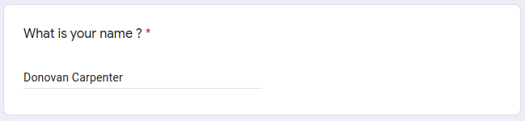
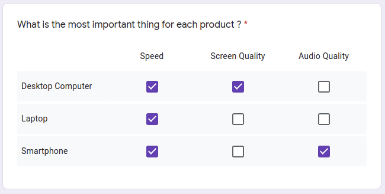

# gform-data-generator

**gform-data-generator** is a Node.js script used to automatically generate large quantities of pseudo-random Google Form answers and export them into CSV files. This script uses [Faker.js](https://github.com/marak/Faker.js/) to generate large amounts of realistic fake free text answers.

The generated CSV files strictly follow the strctures of the ones generated by Google Forms when you export your form's answers.

# Overview
In order to use this tool, you must have to create a JSON file that represents your Google Form (the questions, the different answer options, etc.). Please refer the **How to Use** section to learn more about the forms JSON format. It is possible to generate answers for multiple forms by simply using different JSON files at once. After placing the JSON files in the `forms` directory, and running the script, it will generate one CSV file per JSON form containing the generated answers inside de `output` directory.

In the JSON form description, each answer option contains an answer probability, indicating the probability that this answer will be chosen over another during the random answer generation. This way, it is possible to specifiy answer tendancies, that will be more or less reflected in the final result according to the amount of answers generated. The more answers are generated, the more likely it is that the answer options distribution will match the given probabilities.

# Installation
In order to use this tool, you must have [Node.js](https://nodejs.org/en/download/) installed on your computer. After downloading this repository, install the required dependencies by running the following command at the root of the repository :

> `npm install`

# How to Use
### Create Your JSON Jorm File
In order for the script to generate answers for your form, you need to describe it in a JSON file. A [JSON Schema](https://github.com/souyahia/gform-data-generator/blob/master/schemas/form.json) (Draft #7) is available in the `schemas` directory to help you validate your JSON file. Please refer to the **Form JSON Schema Description** subsection for a detailed description of the JSON format for the forms.

### Run the script
Once your JSON files are created, place them in the `forms` directory at the root of the repository. You can then run the script by running the following command at the root of the repository :

> `npm start`

The script will first validate your JSON files, and display you the validation errors if there are some. If your files are valid, the script will generate one CSV file per form in the `output` directory containing the generated answers for your form.

# Form JSON Schema Description

The root of your JSON file should have the following properties :

| property | type | required | description |
|---|---|---|--- |
| `title` | `string` | ✔️| The title of your form. This will also be the name of the generate CSV file containing the answers to your form. |
| `locale` | `string` | ✔️| The language of your form. This is the locale given to Faker.js when generating the free text answers. Therefore, the only values accepted are the locale values available in the Faker.js library. Please checkout their [repository](https://github.com/marak/Faker.js/) for more details. |
| `dateMin` | `number` | ✔️| **Milliseconds timstamp** indicating the minimum value (included) for the generated answer timestamps. Has to be <= `dateMax`. |
| `dateMax` | `number` | ✔️| **Milliseconds timstamp** indicating the maximum value (included) for the generated answer timestamps. Has to be >= `dateMin`. |
| `answerCount` | `number` | ✔️| The number of answers to generate. Has to be >= 0. |
| `questions` | `array` | ✔️| The questions of your form. Please refer to the table below for more information. |

### Questions JSON Schema Summary

The questions objects contained in the `questions` property of your form must have the following properties :

| property | type | required | description |
|---|---|---|--- |
| `title` | `string` | ✔️| The title of your question as it is displayed in your form. |
| `type` | `string` | ✔️| The type the question. The available values are : `FREE_TEXT`, `MULTIPLE_CHOICE`, `CHECKBOXES`, `DATE`, `TIME`, `MULTIPLE_CHOICE_GRID` and `CHECKBOX_GRID`. Please refer to the following subsections for more details on each type of questions. |
| `required` | `boolean` | ✔️| Indicates if the question is required or if it can be skipped. |

### Free Text Questions

The questions marked with the type `FREE_TEXT` correspond to the Short Answer and Long Answer categories in Google Form. The answers for this type of answers are generated using the `Faker.fake()` interpolation method.

In addition to the properties described in the previous subsection, the `FREE_TEXT` questions must have the following extra properties :

| property | type | required | description |
|---|---|---|--- |
| `answerModel` | `string` | ✔️| The interpolation string value passed to the `Faker.fake()` call. The interpolation values given must be valid Faker.js calls. Please refer to the [Faker.js repository](https://github.com/marak/Faker.js/) for more details. |
| `noAnswerProbability` | `number` | | **Required if `required = false`**. The probability (between 0 and 1) that this question will be skipped (not answered) during the answer generation. This value is ignored if the question is required. |

### Multiple Choice & Checkboxes Questions

The questions marked with the type `MULTIPLE_CHOICE` or `CHECKBOXES` correspond respectively to the multiple choice and checkboxes questions categories in Google Form. For each answer option, you can specify the probability (between 0 and 1) that this answer will be chosen instead of the others. **The sum of all probabilities have to be equal to 1.**

**⚠️ IMPORTANT NOTE :** When dressing your answer options distributions, do no not forget to take into account the `noAnswerProbability` if the question is not required ! If the question if not required, the actual probability that an answer option will be selected is `(1 - noAnswerProbability) * probability`. For example :

| Answer Option | Probability | Actual probability that this option will be selected |
|---|---|---|
| No Answer | 0.1 | 0.1 |
| A | 0.6 | (1 - 0.1) * 0.6 = 0.54 |
| B | 0.4 | (1 - 0.1) * 0.4 = 0.36 |

In addition to the properties described in the **Questions JSON Schema Summary** subsection, the `MULTIPLE_CHOICE` and `CHECKBOXES` questions must have the following extra properties :

| property | type | required | description |
|---|---|---|--- |
| `answerOptions` | `array` | ✔ | The array representing the different answer options available. See the table below for more information. |
| `noAnswerProbability` | `number` | | **Required if `required = false`**. The probability (between 0 and 1) that this question will be skipped (not answered) during the answer generation. This value is ignored if the question is required. |

Each answer option must have the following properties :

| property | type | required | description |
|---|---|---|--- |
| `type` | `string` | ✔ | The type of answer option. The available values are : - `FIXED` for an answer with a fixed value - `OTHER` for the free text option. The answers for this type of answer options are generated using the `Faker.fake()` interpolation method. |
| `probability` | `number` | ✔ | The probability, between 0 and 1, that this answer will be selected instead of others. It **has to be a number between 0 and 1 included** and **the sum of the probabilities of all the answer options in the question must be equal to 1**. |
| `value` | `string` | | **Required if `type = "FIXED"`**. The value of the answer option. |
| `answerModel` | `string` | | **Required if `type = "OTHER"`**. The interpolation string value passed to the `Faker.fake()` call. The interpolation values given must be valid Faker.js calls. Please refer to the [Faker.js repository](https://github.com/marak/Faker.js/) for more details. |

### Date Questions

The questions marked with the type `DATE` correspond to the date questions category in Google Form. You have to specify a minimum and a maximum value for the date. The generated answers will be approximately uniformely distributed between these two values.

In addition to the properties described in the **Questions JSON Schema Summary** subsection, the `DATE` questions must have the following extra properties :

| property | type | required | description |
|---|---|---|--- |
| `min` | `number` | ✔ | **Milliseconds timstamp** indicating the minimum value (included) for the generated answer. Has to be <= `max`. |
| `max` | `number` | ✔ | **Milliseconds timstamp** indicating the maximum value (included) for the generated answer. Has to be >= `min`. |
| `withYear` | `boolean` | ✔ | Indicates whether or not the year also have to be specified in the answer (this is a Google Form option).  |
| `withTime` | `boolean` | ✔ | Indicates whether or not the time also have to be specified in the answer (this is a Google Form option). |
| `noAnswerProbability` | `number` | | **Required if `required = false`**. The probability (between 0 and 1) that this question will be skipped (not answered) during the answer generation. This value is ignored if the question is required. |

### Time Questions

The questions marked with the type `TIME` correspond to the date and duration questions categories in Google Form. You have to specify a minimum and a maximum value for the date. The generated answers will be approximately uniformely distributed between these two values. 

In addition to the properties described in the **Questions JSON Schema Summary** subsection, the `TIME` questions must have the following extra properties :

| property | type | required | description |
|---|---|---|--- |
| `min` | `string` | ✔ | **String in the `HH:MM:SS` format** indicating the minimum value (included) for the generated answer. Has to be <= `max` and as specified by Google Form, it has to be between `00:00:00` and `72:59:59`. |
| `max` | `string` | ✔ | **String in the `HH:MM:SS` format** indicating the maximum value (included) for the generated answer. Has to be >= `min` and as specified by Google Form, it has to be between `00:00:00` and `72:59:59`. |
| `noAnswerProbability` | `number` | | **Required if `required = false`**. The probability (between 0 and 1) that this question will be skipped (not answered) during the answer generation. This value is ignored if the question is required. |

### Multiple Choice Grid & Checkbox Grid Questions

The questions marked with the type `MULTIPLE_CHOICE_GRID` or `CHECKBOX_GRID` correspond respectively to the multiple choice grid and checkbox grid question categories in Google Form. For each line, you can specify a probability array (between 0 and 1) that indicates the probability of each column to be selected. **The sum of all probabilities of the array have to be equal to 1.** 

**⚠️ IMPORTANT NOTE :** When dressing your answer options distributions, do no not forget to take into account the `noAnswerProbability` if the question is not required ! Please refer to the **Multiple Choice & Checkboxes Questions** subsection for more information.

In addition to the properties described in the **Questions JSON Schema Summary** subsection, the `MULTIPLE_CHOICE_GRID` and `CHECKBOX_GRID` questions must have the following extra properties :

| property | type | required | description |
|---|---|---|--- |
| `columns` | `array` | ✔ | **Array of strings** representing the title of the available columns of the question. |
| `lines` | `array` | ✔ | **Array of objects** representing the lines of the grid. Please refer to the following table for more information. |

Each line in the grid lines array must have the following properties :

| property | type | required | description |
|---|---|---|--- |
| `title` | `string` | ✔ | The title of the line. |
| `probabilityGrid` | `array` | ✔ | **Array of numbers between 0 and 1** indicating the probability for each column to be selected in this line. **The sum of all probabilities of the array have to be equal to 1.**  |
| `noAnswerProbability` | `number` |  | **Required if the parent question has `required = false`**. The probability (between 0 and 1) that this line will be skipped (not answered) during the answer generation. This value is ignored if the parent question is required. |
